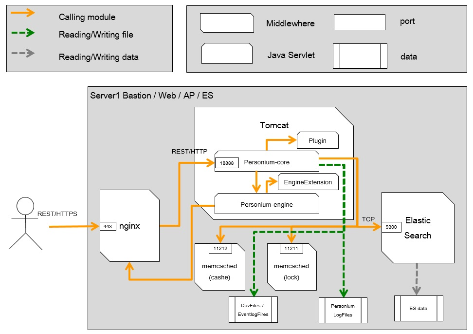

# 1-server unit setup with Ansible
---------------------------------------

## Overview
The purpose of this document is to explain explecitely how to construct Personium unit on 1 server using Ansible.
This ansible is checking the operation with Personium version 1.5.2 later and CentOS 7.2.

## Server setup :white_check_mark:

#### server configuration sample
  Below are the server structure that we configured.

|**Servers**      |   **Role**      |   **MW**                           |  **default memory size** (*1) |   **AWS EC2 specs** (*2)|  
|:----------------|:----------------|:-----------------------------------|:------------------------------|:-------------------------|
| Server 1        |  Bastion,Web,AP,ES    | nginx,tomcat(768MB),memcached(256MB*2),Elasticsearch(1875MB)                     |3155MB                         |      m3.medium            |

(*1) : Required default memory size. Memory size of each MW configuration file could be modified

(*2) : Tested AWS EC2 instance specs  



#### File structure

| File name | Contents |
|---|---|
| `/init_personium.yml`  |		yml file which should be executed by Ansible-playbook|
| `/[group name].yml`	   |		yml file to retrieve the variable of each group and execute its related tasks|
| `/Ansible.cfg`         |		Describes the required Settings for Ansible execution. (\*Modification is not required)|
| `/static_inventory/`   |		This folder contains all the essential information of different environments|
| `/static_inventory/hosts\*#`	          |        Describes information of hosts (IP address, FQDN, group, User name, Private Key, etc.)|
| `/group_vars/`	       |		Folder to organize files in order to perform various customization or tuning on servers|
| `/group_vars/[group name].yml\*#`  |		   Collections of values for each group, which requires to customize/tune the settings|
| `/resource/`		   |	    Folder to organize files which are necessary in task (\*Modification is not required)|
|  `/resource/[groue name]/`	   |		Store the resources of each group|
|  `/tasks/`			   |    	Folder to organize task|
|  `/tasks/[groue name]/`	   |		Store specific task for each group|
|  `/handlers/`		   |	    Folder to organize handlers|
|  `/handlers/[group name]/`	   |		Store handler for each group|


  \*# : Files required to modify according to the environment.

  \*[group name] : web, ap, nfs, es, bastion and common. All in all 6 groups.
  (Here `common` is not the server role. Common group is used to set some general functionalities on all the servers.)

#### File (key) handling Caution: :zap:

The following key file will be generated automatically during the Ansible execution. Please handle these keys carefully.

`/personium/Personium-core/conf/salt.key`

`/personium/Personium-core/conf/token.key`

## Initial setup for Ansible :white_check_mark:

* Prerequisite:
  * User account: root
  * Ansible execution user account: root
  * Ansible execution environment : Web/Bastion server
  * DNS registered fixed global IP address
  * Fixed private IP of all the remote servers.


#### 1: Setup Ansible parameters

* Edit the following files of Ansible folder
  * Edit `/static_inventory/hosts` file and set the value of each parameter.
  * Check `/group_vars/[group name].yml` file. Re-set the parameter value, if server tuning is necessary.  
\* Please refer to [Ansible Settings Instruction](Ansible_Settings_Instruction.md "") file, for more details about each parameter.

#### 2: Deploy Ansible (server destination : Bastion server)

* Connect to the Bastion server using WinSCP or other related tools  
\* WinSCP : https://winscp.net/eng/download.php
* Upload the `Ansible` folder on Bastion server under `/root/` directory.


#### 3: Prepare Self-signed unit certificate and secret key

* Please refer to [How to generate Self-signed Unit Certificate](How_to_generate_Self-signed_Unit_Certificate.md ""), for self-signed unit certificate creation procedure.


#### 4: Configure the self-signed unit certificate and private key

* Arrange certificate
  * Deploy the **self-signed unit certificate** and **private key** under `ansible/resource/ap/opt/x509/` folder with the following file names.
    - unit-self-sign.crt(self-signed unit certificate)
    - unit.key(private key)  
\* You may escape the procedure above, if the self-signed unit certificate is created based on the [How to generate Self-signed Unit Certificate](How_to_generate_Self-signed_Unit_Certificate.md "").

#### 5: Prepare SSL certificate / private key

* Prepare the SSL certificate and private key separately  
\* Create and use self-signed SSL certificate unless the official SSL certificate is not available.
Following is the self-signed ssl certificate creation procedure.

```console
    # cd /root/ansible/resource/web/opt/nginx/conf
    # openssl genrsa -des3 -out server.key 1024
           Enter pass phrase for server.key:                            \* Optional (Characters length: is 4 - 8191)
    # openssl req -new -key server.key -out server.csr
           Enter pass phrase for server.key:                            \* enter the value of `server.key`
           Country Name (2 letter code) [XX]:                           \* Optional ( entered value will be visible in the certificate)
           State or Province Name (full name) []:                       \* Optional ( entered value will be visible in the certificate)
           Locality Name (eg, city) [Default City]:                     \* Optional ( entered value will be visible in the certificate)
           Organization Name (eg, company) [Default Company Ltd]:       \* Optional ( entered value will be visible in the certificate)
           Organizational Unit Name (eg, section) []:                   \* Optional ( entered value will be visible in the certificate)
           Common Name (eg, your name or your server's hostname) []:    \* Optional ( entered value will be visible in the certificate)
           Email Address []:                                            \* Optional ( entered value will be visible in the certificate)

               Please enter the following 'extra' attributes
               to be sent with your certificate request
               A challenge password []:
               An optional company name []:

    # cp server.key server.key.org
    # openssl rsa -in server.key.org -out server.key
           Enter pass phrase for server.key.org:     \* enter the value of `server.key`
    # openssl x509 -req -days 365 -in server.csr -signkey server.key -out server.crt
    # ls -l server.*
```

  - Check if the following files are created
    - server.key.org
    - server.crt
    - server.csr
    - server.key  

#### 6: Deploy SSL certificate / private key

* Certificate deployment
   * Deploy the certificate under `/root/ansible/resource/web/opt/nginx/conf/` folder
```
    /root/ansible/resource/web/opt/nginx/conf/
       - server.crt(SSL certificate)
       - server.key(private key)
```

\* In the case of Self-signed SSL certificate, the above process is not required to follow.

#### 7: Generate SSH key

* Setup the ssh keys (RSA key pair) to access other servers from bastion server as "root" user. Follow the steps below:

##### **Step 1:** Create the RSA Key Pair on the client machine (Bastion server)

* The entire key generation process looks like as follows:

```console
    # ssh-keygen -t rsa
    Generating public/private rsa key pair.
    Enter file in which to save the key (/root/.ssh/id_rsa):  (\* press enter to save the rsa key pair at /root/.ssh/id_rsa, otherwise specify the alternative path)
    Enter passphrase (empty for no passphrase):               (\* press enter to save the key without password)
    Enter same passphrase again:                              (\* press enter if no password added on passphrase)
    Your identification has been saved in /root/.ssh/id_rsa.  (\* press enter)
    Your public key has been saved in /root/.ssh/id_rsa.pub.  (\* press enter)
```

The `public key` will be placed in `/root/.ssh/id_rsa.pub`

The `private key` (identification) will be placed in `/root/.ssh/id_rsa`


##### **Step 2:** Put the public key to other remote servers. Follow the steps below:

* Copy the public key from bastion server

```console
    # cat /root/.ssh/id_rsa.pub
    sample output)
    ------------------
    ssh-rsa AAAAB3NzaC1yc2EAAAABIwAAAQEAxUTAHN8vxgp8w2tBeSYKLDvISg3LF9W/iiIQ5boQNPfHQkpXtbFAVmQ1uDMBf3bUOzQN0
    Hr+YnAtiV1D7mPjRdBapM7dzI3o4hcuy1Jk9o6J6ZY4SQosH23jOJJZhz0yLn/ACQ+aKeIu3DPj4Pw4C/BUfd+JlFGCRcr/OTjLmqtVer
    W70LLGSh1CwYr/b7uvKjxdzArxKlzsvCpGBU69Vn0g5+tUzOtvMEYRz1Jttn1gxrRpCqIUbtRbIlYEoNYpzt0hVBfOhNtfbBE8yb8Lw1A
    enBBP0WcBI7uGJpIdIhlPSIiOqyfG/XnSCVOWZCFGIc13CtOjHq3rabcdefg== root@ip-XX-XX-XX-XX
   ------------------
```

* Add the public key of bastion server in **/root/.ssh/authorized_keys** of all target **remote servers**
   * Access to each remote server, and add the  bastion server root public key in /root/.ssh/authorized_keys

- Access to the remote server

```console
    $ su -  (\* switch to the root user)
    # vim /root/.ssh/authorized_keys  (\* Add the key below and save)
    -----------------
    ssh-rsa AAAAB3NzaC1yc2EAAAABIwAAAQEAxUTAHN8vxgp8w2tBeSYKLDvISg3LF9W/iiIQ5boQNPfHQkpXtbFAVmQ1uDMBf3bUOzQN0
    Hr+YnAtiV1D7mPjRdBapM7dzI3o4hcuy1Jk9o6J6ZY4SQosH23jOJJZhz0yLn/ACQ+aKeIu3DPj4Pw4C/BUfd+JlFGCRcr/OTjLmqtVer
    W70LLGSh1CwYr/b7uvKjxdzArxKlzsvCpGBU69Vn0g5+tUzOtvMEYRz1Jttn1gxrRpCqIUbtRbIlYEoNYpzt0hVBfOhNtfbBE8yb8Lw1A
    enBBP0WcBI7uGJpIdIhlPSIiOqyfG/XnSCVOWZCFGIc13CtOjHq3rabcdefg== root@ip-XX-XX-XX-XX
    ------------------
```
- Notes:
  1. vi command displays the contents of the file
  2. Press [i] to change the file to edit mode, and you will be able to copy the public key
  3. Paste the public key, copied from bastion server
  4. Press [Esc], then type [:wq!] to save the file

- If the directory and the file are not available on remote servers, then create them first

```console
    # mkdir .ssh
    # touch authorized_keys
```

* Check the permission. Change if necessary

```console
    # ls -la /root/.ssh/authorized_keys
    -rw-------. 1 root root 952 Aug 27 02:41 /root/.ssh/authorized_keys
```

- Change the permission if required

```console
    # chmod 600 /root/.ssh/authorized_keys
    # ls -la /root/.ssh/authorized_keys
    -rw-------. 1 root root 952 Aug 27 02:41 /root/.ssh/authorized_keys

    # ls -la /root/
    drwx------.  2 root root 4096 Aug 27 02:41 .ssh
```

- Change the permission if required

```console
    # chmod 700 /root/.ssh
    # ls -la /root/.ssh
    drwx------.  2 root root 4096 Aug 27 02:41 .ssh
    # exit
```

##### **Step 3:** SSH connection test (\* Access to remote servers as root user form Bastion server using the private key)

```console
- Access to Bastion server
    $ su -  (\* switch to the root user)
    # ssh -i ~/.ssh/id_rsa root@[Private IP of remote server]  (\*ssh to remote servers as root user)

    # exit (\* Exit from remote server, after confirming the successful access from bastion server)
```

## Ansible configuration :white_check_mark:


#### 1: Install Ansible(Client server : Bastion server)

* Add epel repository to Bastion server

```console
    # yum localinstall http://dl.fedoraproject.org/pub/epel/6/x86_64/epel-release-6-8.noarch.rpm
    this ok [y/N]:  (\* type [y] and press enter)
```

* Install Ansible

```console
    # yum install ansible
    this ok [y/N]:  (\* type [y] and press enter)
```

#### 2: Check the Ansible configuration file on client server (Bastion server)

* Access to Bastion server and check the following Ansible setup files, if those are configured properly

  1) /hosts file   (\* Static inventory file)
  \* Check the hosts file if anything is missing

```console
      # cat /root/ansible/static_inventory/hosts | grep "{"
```

  - If nothing shows, meaning all are configured

  2) /group_vars/[group name].yml file    (\* Group Variable files)
  \* Check if all the yml files under group_vars are modified as required

```console
      # cat /root/ansible/group_vars/ap.yml
      # cat /root/ansible/group_vars/bastion.yml
      # cat /root/ansible/group_vars/common.yml
      # cat /root/ansible/group_vars/es.yml
      # cat /root/ansible/group_vars/nfs.yml
      # cat /root/ansible/group_vars/web.yml
```

#### 3: Execute Ansible

* Access to the Bastion server and change to the `Ansible` directory

```console
    # cd /root/ansible/
```

* Execute Ansible

```console
    # date; ansible-playbook init_personium.yml ; date
```

  \* After few minutes-hours (varies on case by case) Ansible process will be done. (\* Don't kill the process in between) Personium Unit will be created with the configured FQDN. Also will be accessible from web (ex: https&#58;//FQDN)

* Confirm if Ansible executed properly

```console
  # egrep -B 3 -A 3 'failed:|error' /root/ansible.log
```

  Check the Ansible log file, if it shows any error

#### 4: Deployment testing on Bastion server

* Execute the reachability testing tool

```
    # /bin/sh personium_regression.sh https://{{ FQDN of Web server }}
    [PCS Version(default) RT OK]
```

\* reachability testing is done, if it shows the same

 For the developers conveniency this document introduced the procedure to construct Personium unit using Ansible.
Hope developers will enjoy deploying Personium unit on any of their suitable environment. Please try Personium and let us know your feedback or comments for further betterment of Personium. Your feedback and comments will be highly appreciated.

--------------------------------------------------------------------
