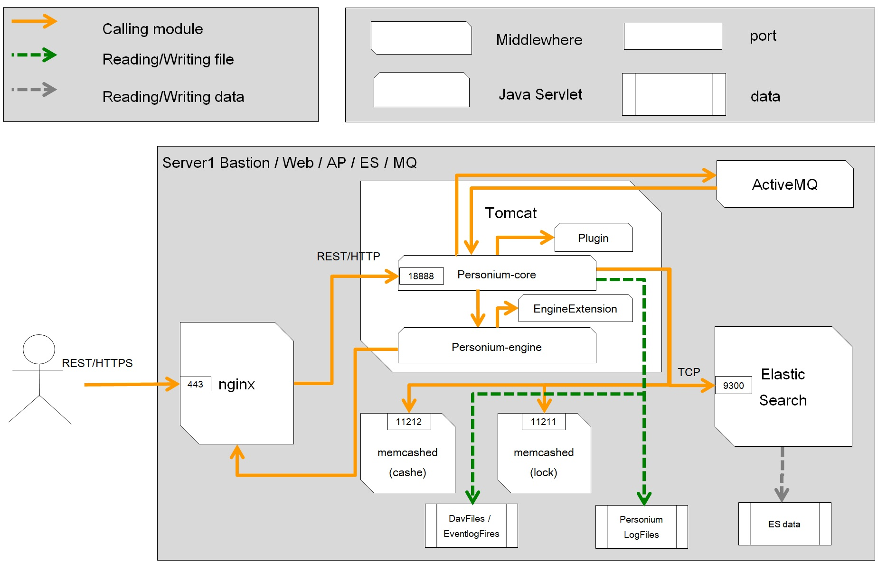

# all-in-one unit setup with Ansible
---------------------------------------

## Overview
The purpose of this document is to explain explicitly how to construct Personium unit on all-in-one using Ansible.
This ansible is checking the operation with Personium version 1.5.2 later and CentOS 7.2.

## Server setup :white_check_mark:

#### server configuration sample
  Below are the server structure that we configured.

|**Servers**      |   **Role**      |   **MW**                           |  **default memory size** (*1) |   **AWS EC2 specs** (*2)|  
|:----------------|:----------------|:-----------------------------------|:------------------------------|:-------------------------|
| Server 1        |  Bastion,Web,AP,NFS,MQ,ES    | nginx,tomcat(768MB),memcached(256MB*2),ActiveMQ,Elasticsearch(1875MB)                     |3155MB                         |      m3.medium            |

(*1) : Required default memory size. Memory size of each MW configuration file could be modified

(*2) : Tested AWS EC2 instance specs  



#### File structure

| File name | Contents |
|---|---|
| `/init_personium.yml`  |		yml file which should be executed by Ansible-playbook|
| `/[group name].yml`	   |		yml file to retrieve the variable of each group and execute its related tasks|
| `/Ansible.cfg`         |		Describes the required Settings for Ansible execution. (\*Modification is not required)|
| `/static_inventory/`   |		This folder contains all the essential information of different environments|
| `/static_inventory/hosts\*#`	          |        Describes information of hosts (IP address, FQDN, group, User name, Private Key, etc.)|
| `/group_vars/`	       |		Folder to organize files in order to perform various customization or tuning on servers|
| `/group_vars/[group name].yml\*#`  |		   Collections of values for each group, which requires to customize/tune the settings|
| `/resource/`		   |	    Folder to organize files which are necessary in task (\*Modification is not required)|
|  `/resource/[groue name]/`	   |		Store the resources of each group|
|  `/tasks/`			   |    	Folder to organize task|
|  `/tasks/[groue name]/`	   |		Store specific task for each group|
|  `/handlers/`		   |	    Folder to organize handlers|
|  `/handlers/[group name]/`	   |		Store handler for each group|


  \*# : Files required to modify according to the environment.

  \*[group name] : web, ap, nfs, es, bastion and common. All in all 6 groups.
  (Here `common` is not the server role. Common group is used to set some general functionalities on all the servers.)

#### File (key) handling Caution: :zap:

The following key file will be generated automatically during the Ansible execution. Please handle these keys carefully.

`/personium/Personium-core/conf/salt.key`

`/personium/Personium-core/conf/token.key`

## Initial setup for Ansible :white_check_mark:

* Prerequisite:
  * All infrastructure is created
  * User account: sudo user
  * Ansible execution user account: sudo user
  * Ansible execution environment : server 1
  * Fixed global IP address is attached to the server 1
  * Fixed private IP of all the remote servers.

#### 1: Configure DNS setting

See [DNS Setup for per-cell URL](../DNS_Setup_for_per-cell_url.md).

#### 2: Log in Server 1

Log in Server 1. Then, switch user which has sudo privilege.

#### 3: Git clone Ansible

* Using git client, clone the `ansible` repository (https://github.com/personium/ansible) to your local environment.  
\* Please clone or download the zip file from the release branch.  
\* Since the master branch may contain new features which are under testing and development, erroneous behavior may be expected.  
\* From now on, we describe `all-in-one` under cloned folder as `$ansible`.

#### 4: Setup Ansible parameters

* Edit the following files
  * Edit `$ansible/static_inventory/hosts` file and set the value of each parameter.
  * Check `$ansible/group_vars/[group name].yml` file. Re-set the parameter value, if server tuning is necessary.  
\* Please refer to [Ansible Settings Instruction](Ansible_Settings_Instruction.md "") file, for more details about each parameter.

#### 5: Prepare Self-signed unit certificate and secret key

* Please refer to [How to generate Self-signed Unit Certificate](../How_to_generate_Self-signed_Unit_Certificate.md ""), for self-signed unit certificate creation procedure.

#### 6: Configure the self-signed unit certificate and private key  
You may skip this procedure if the self-signed unit certificate is created based on the procedures from the previous step ([How to generate Self-signed Unit Certificate](../How_to_generate_Self-signed_Unit_Certificate.md "")).  

* Arrange certificate  
Deploy the **self-signed unit certificate** and **private key** under `$ansible/resource/ap/opt/x509/` folder with the following file names.   
    - unit-self-sign.crt(self-signed unit certificate)
    - unit.key(private key)  

#### 7: Prepare SSL certificate / private key

* Prepare the SSL certificate and private key separately  
If you have a domain and can set it to DNS, you can use an official SSL certificate. [Example of using Let's Encrypt.](../Create_Server_Certificate_for_Letsencrypt.md)  
* Create and use self-signed SSL certificate when the official SSL certificate is not available.
[Example of using Self-sign.](../Create_Server_Certificate_for_Self-sign.md)

#### 8: Deploy SSL certificate / private key  
You may skip this procedure if you use the procedures from previous step to generate SSL certificate.  

* Certificate deployment  
Deploy the certificate under `$ansible/resource/web/opt/nginx/conf/` folder.  
```
$ansible/resource/web/opt/nginx/conf/
  - server.crt(SSL certificate)
  - server.key(private key)
```  

## Ansible configuration :white_check_mark:


#### 1: Install Ansible(Client server : Bastion server)

* Add epel repository to Bastion server

```console
    $ sudo yum install epel-release
    this ok [y/N]:  (\* type [y] and press enter)
```

* Install Ansible

```console
    $ sudo yum install ansible
    this ok [y/N]:  (\* type [y] and press enter)
```

#### 2: Check the Ansible configuration file on client server (Bastion server)

* Access to Bastion server and check the following Ansible setup files, if those are configured properly

  1) /hosts file   (\* Static inventory file)
  \* Check the hosts file if anything is missing

```console
      $ cat $ansible/static_inventory/hosts | grep "{"
```

  - If nothing shows, meaning all are configured

  2) /group_vars/[group name].yml file    (\* Group Variable files)
  \* Check if all the yml files under group_vars are modified as required

```console
      $ cat $ansible/group_vars/ap.yml
      $ cat $ansible/group_vars/bastion.yml
      $ cat $ansible/group_vars/common.yml
      $ cat $ansible/group_vars/es.yml
      $ cat $ansible/group_vars/nfs.yml
      $ cat $ansible/group_vars/web.yml
```

#### 3: Execute Ansible

* Access to the Bastion server and change to the `Ansible` directory

```console
    $ cd $ansible
```

* Execute Ansible

```console
    $ date; ansible-playbook init_personium.yml ; date
```

  \* After few minutes-hours (varies on case by case) Ansible process will be done. (\* Don't kill the process in between) Personium Unit will be created with the configured FQDN. Also will be accessible from web (ex: https&#58;//FQDN)

* Confirm if Ansible executed properly

```console
  $ egrep -B 3 -A 3 'failed:|error' $ansible/ansible.log
```

  Check the Ansible log file, if it shows any error  
  If there is no error, please restart the constructed server

#### 4: Deployment testing on Bastion server

* Execute the reachability testing tool

```
    $ sudo /bin/sh personium_regression.sh {{ FQDN of Web server }}
    [personium Version(default) RT OK]
```

\* reachability testing is done, if it shows the same

 For the developers convenience this document introduced the procedure to construct Personium unit using Ansible.
Hope developers will enjoy deploying Personium unit on any of their suitable environment. Please try Personium and let us know your feedback or comments for further betterment of Personium. Your feedback and comments will be highly appreciated.

--------------------------------------------------------------------
